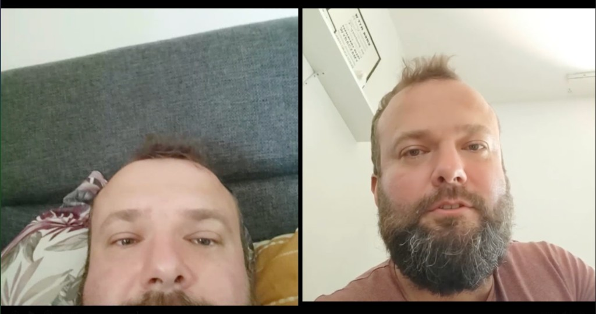

# Cloner

An interactive art-installation web app that turns a participant's confession, voice sample, and photo into a personalized talking-head video, then records their live reaction in a side-by-side composite.



This is an **experimental MVP** — some pipeline steps (notably the final composite upload) are still being refined.

## Features

- Multi-step clone wizard: password gate, welcome, personal truth, voice recording, photo capture, AI pipeline, reaction recording
- **i18n**: Polish (default), English, Russian
- **ElevenLabs**: voice cloning and text-to-speech
- **Replicate**: Claude script generation and talking-head video
- **Supabase**: private storage bucket and session tracking
- Browser-side face detection (modern-face-api) for photo capture
- Glitch-style transitions between wizard steps

## Architecture

```mermaid
flowchart LR
  User[Participant] --> Wizard[CloneWizard]
  Wizard --> Truth[Truth + Voice + Photo]
  Truth --> Analyze["POST /api/analyze-clone"]
  Analyze --> Script[Replicate Claude script]
  Script --> TTS[ElevenLabs TTS]
  TTS --> Video[Replicate talking-head]
  Video --> Storage[Supabase cloner-uploads]
  Storage --> Reaction[Reaction step composite]
```



## Prerequisites

- **Node.js 20+**
- [Supabase](https://supabase.com) project (Storage + Postgres)
- [Replicate](https://replicate.com) API token
- [ElevenLabs](https://elevenlabs.io) API key

## Setup

### 1. Install dependencies

```bash
npm install
```

### 2. Environment variables

Copy the template and fill in real values:

```bash
cp .env.example .env.local
```

See [.env.example](.env.example) for all variables. At minimum you need:

| Variable | Purpose |
|----------|---------|
| `CLONER_ACCESS_PASSWORD` | Access gate for production (optional locally) |
| `NEXT_PUBLIC_SUPABASE_URL` | Supabase project URL |
| `NEXT_PUBLIC_SUPABASE_ANON_KEY` | Browser-safe key for signed uploads |
| `SUPABASE_SERVICE_ROLE_KEY` | Server-only key for pipeline writes |
| `REPLICATE_API_TOKEN` | Script + video generation |
| `REPLICATE_VIDEO_MODEL` | Talking-head model (e.g. `owner/model-name`) |
| `ELEVENLABS_API_KEY` | Voice clone + TTS |
| `ELEVENLABS_IMAGE_API_URL` | Image generation endpoint (for `/image-gen` utility) |

Never commit `.env.local`.

### 3. Supabase migrations

Run the SQL files in [supabase/migrations/](supabase/migrations/) in order (001 → 005) in the Supabase SQL editor:

1. `001_cloner_storage.sql` — private storage bucket
2. `002_increase_bucket_limit.sql` — bucket size limits
3. `003_clone_sessions.sql` — session table
4. `004_archive_numbers.sql` — archive numbering
5. `005_clone_sessions_rls.sql` — row-level security

### 4. Face detection models

Model weights are binary and not committed. Copy them from the installed package:

```bash
mkdir -p public/models
cp -R node_modules/modern-face-api/weights/* public/models/
```

### 5. Run locally

```bash
npm run dev
```

Open [http://localhost:3000](http://localhost:3000).

Verify provider credentials:

```bash
npm run check:providers
```

Or visit `/api/provider-check` while the dev server is running.

## Scripts

| Command | Description |
|---------|-------------|
| `npm run dev` | Start development server |
| `npm run build` | Production build |
| `npm run start` | Start production server |
| `npm run check:providers` | Test ElevenLabs + Replicate connectivity |
| `npm run lint` | Run ESLint |

## Production deployment

Set `CLONER_ACCESS_PASSWORD` in your hosting environment. The access gate in [proxy.ts](proxy.ts) protects wizard and API routes when this variable is set.

**Important:** If `CLONER_ACCESS_PASSWORD` is unset, all routes — including expensive AI APIs — are open. Always set it before deploying publicly.

## Project structure

```
app/
  clone/           # Multi-step wizard and step components
  api/             # Server routes (analyze-clone, session, auth, etc.)
  image-gen/       # ElevenLabs image API test UI
  design-system/   # Internal component gallery
lib/
  cloner/          # Core domain (TTS, video, uploads, i18n)
  supabase/        # Browser + admin Supabase clients
supabase/migrations/   # Database and storage setup
hooks/             # Webcam, audio, face detection, media recorder
public/models/     # Face-api weights (local only, gitignored)
```

## Security

This repo contains **no API keys** — secrets belong in `.env.local` only.

If you self-host or keep a live deployment online:

1. **Always set `CLONER_ACCESS_PASSWORD`** in production.
2. **Rotate credentials** if you ever used a real password in local config or old commits.
3. **Review session access**: session assets are keyed by UUID; there is no per-session secret yet. Do not expose session IDs publicly.
4. **Protect `/api/provider-check`** in production — it calls upstream APIs and can consume quota.
5. Enable GitHub **secret scanning** and **Dependabot alerts** on your repository.

Known auth limitations (future hardening): the access cookie currently stores the plaintext gate password rather than a signed session token.

## License

[MIT](LICENSE)
